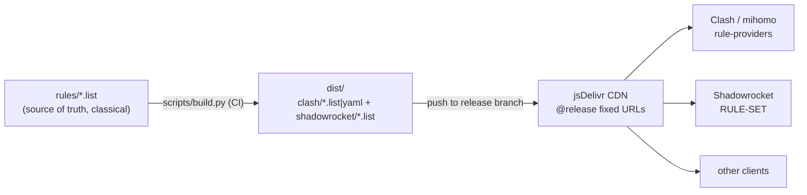

# clash-rules

Personal, categorized proxy rule-sets — **single source of truth, built once,
consumed by every client** (Clash / mihomo, Shadowrocket, …).

Companion to [DockerCompose-V2Ray](https://github.com/daviddwlee84/DockerCompose-V2Ray)
(the server side). The design follows the best practices researched in
[`docs/clash/SelfHostProviders.md`](https://github.com/daviddwlee84/DockerCompose-V2Ray/blob/master/docs/clash/SelfHostProviders.md)
— maintain rules in one git repo, convert with one build step, publish to fixed
URLs, and point all clients there. Update once → everything applies.



## Layout

| Path | Purpose |
|---|---|
| `rules/*.list` | **The only files you edit.** One category per file, classical syntax (rule **minus** policy — policy comes from the `RULE-SET,<name>,<policy>` line in each client's base config). `#` comments allowed. |
| `scripts/build.py` | Validates every line, then emits per-client formats into `dist/`. Fails CI on any malformed rule. PEP 723 [uv](https://docs.astral.sh/uv/) script — run with `uv run`. |
| `examples/clash.yaml` | How to consume via mihomo `rule-providers` + `RULE-SET`. |
| `examples/shadowrocket.conf` | How to consume the same lists from Shadowrocket. |
| `.github/workflows/build.yml` | CI: validate + build on every push, publish `dist/` to the **`release`** branch (Loyalsoldier-style). |
| `Justfile` | `just build` / `just check` / `just stats`. |

## Categories

| File | Intended policy | Content |
|---|---|---|
| `ai.list` | `AI` group | AI services (OpenAI/Claude/Cursor/Gemini/Copilot/…) — geo-blocked by IP, pin to US/JP/SG nodes |
| `reject.list` | `REJECT` | ISP hijacking, malware, fake-software (思杰马克丁) domains/IPs |
| `proxy.list` | `PROXY` | DNS-pollution-protected & blocked sites (Google/Meta/Telegram/…) |
| `direct.list` | `DIRECT` | Mainland-China services, CDNs, scholar sites, private trackers |
| `media-global.list` | media group | International streaming (Netflix/YouTube/Disney+/Spotify/…) |
| `media-hkmt.list` | media group | Mainland media with HK/MO/TW-only licensing (bilibili/iQiyi) |
| `apple.list` | `Apple` group | Apple services (choose DIRECT or PROXY per region) |

Base-config-only rules (`GEOIP,CN`, `MATCH`/`FINAL`, LAN handled by GEOIP/private
defaults) intentionally stay **out** of the rule-sets — see the examples.

## Daily workflow

1. Edit the relevant `rules/<category>.list` (add a line, commit).
2. Push to `main` → CI validates, builds, force-pushes `dist/` to `release`.
3. Every client refreshes automatically on its provider `interval`
   (or trigger immediately: `curl -X PUT 'http://127.0.0.1:9090/configs?force=true' -H "Authorization: Bearer $CLASH_SECRET"`).

Local check before pushing:

```bash
just build   # or: uv run scripts/build.py
```

## Consuming

Fixed URLs (jsDelivr CDN over the `release` branch — more GFW-reachable than
raw.githubusercontent.com):

```text
https://cdn.jsdelivr.net/gh/daviddwlee84/clash-rules@release/clash/<category>.list
https://cdn.jsdelivr.net/gh/daviddwlee84/clash-rules@release/shadowrocket/<category>.list
```

See [`examples/clash.yaml`](examples/clash.yaml) and
[`examples/shadowrocket.conf`](examples/shadowrocket.conf) for complete wiring.

## Principles (why it looks like this)

- **Rules are public, nodes are private.** This repo holds only generic
  routing rules — no server addresses, UUIDs, or subscriptions. Node lists
  live elsewhere behind auth (header token / hidden path), per
  [SelfHostProviders.md](https://github.com/daviddwlee84/DockerCompose-V2Ray/blob/master/docs/clash/SelfHostProviders.md).
- **One classical syntax feeds all clients.** Clash `behavior: classical,
  format: text` and Shadowrocket `RULE-SET` accept the same `TYPE,value`
  lines, so the "build" is validation + fan-out, not translation.
- **Consumers pin `@release`, not `main`.** A broken edit on `main` can never
  reach clients — only a green CI build can.
- **Stand on giants for the generic stuff.** For broad categories consider
  layering [Loyalsoldier/clash-rules](https://github.com/Loyalsoldier/clash-rules),
  [MetaCubeX/meta-rules-dat](https://github.com/MetaCubeX/meta-rules-dat) (`.mrs`), or
  [blackmatrix7/ios_rule_script](https://github.com/blackmatrix7/ios_rule_script)
  in your base config, and keep only *personal* categories here.

## Provenance

Initial content migrated from
[DockerCompose-V2Ray `legacy/example/clash_for_windows.yml`](https://github.com/daviddwlee84/DockerCompose-V2Ray/blob/master/legacy/example/clash_for_windows.yml)
(itself derived from common community rule lists circa 2020) via a one-shot
`scripts/migrate_from_legacy.py` (since deleted — see git history): 1272 rules
across 6 categories.

## License

[MIT](LICENSE)
