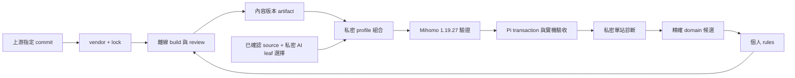

# 政策、資料與私密設定

公開部分保存個人分流意圖、review 歷史與必要的上游資料；私密部分保存節點、訂閱、
source profile、裝置參數與觀測報告。可分享的規則也可能揭露公司內網／使用習慣，發布前仍需審查。



## 鏡像與離線建置

upstreams.lock.json 鎖定 meta branch 資料 commit、master branch 授權／來源 commit，
並列出每個檔案的 bytes 與 SHA-256。目前鏡像 anthropic、openai、google、github、cn、private、
apple-cn、geolocation-!cn 的 geosite，以及 cn／private geoip；沒有要求用戶端追蹤上游。
上游定期產生 meta branch，該分支可被 force-push，所以須保留實際鏡像 bytes。

```sh
python3 scripts/sync_upstreams.py fetch   --revision FULL_DATA_COMMIT --license-revision FULL_SOURCE_COMMIT   --output .cache/review-next
# 審查 .cache/review-next/review.json、資料差異、LICENSE 與 README。
python3 scripts/sync_upstreams.py promote .cache/review-next
just check
just test
just native-check
just build
```

fetch 明確連網，promote 本地提升，check/build 完全離線。上游 AI 新域名只進 review.json，
不自動加入個人 ai.list。若提升中斷造成 data／lock 不符，build 拒絕繼續；用 Git 與保留的
review snapshot 檢查恢復，不忽略 hash failure。

build 只接受明確支援的 DOMAIN、DOMAIN-SUFFIX、DOMAIN-KEYWORD、IP-CIDR、IP-CIDR6。
驗證參數／網段 family 後，保留順序並在分類內去重。dist/review.json 列跨分類重複、
先前 suffix 覆蓋與寬泛 keyword。內容版本來自檔案 hash map，不含時間戳；相同輸入重建相同 bytes。

## Pi 私密候選

基底必須是 Pi active marker 指向的原始 tested source，且與 marker digest 一致。
Nikki 產生的 runtime config 另含 managed mixin，不可當作來源回灌；舊 CFW profile
含 external-controller 時也不可直接使用。

在 ignored private/ 保存 mode 0600 的 policy.json，欄位只有 ai_node 與選填 ai_group。
ai_node 是既有具體 leaf node 名稱，不可引用 url-test、fallback 或其他群組。

```sh
just compose-profile   --base /ABSOLUTE/PRIVATE/baseline.yaml   --expected-base-sha256 BASELINE_SHA256   --policy /ABSOLUTE/PRIVATE/policy.json   --output /ABSOLUTE/PRIVATE/candidate.yaml --dry-run
# 移除 --dry-run 才 exclusive 寫出候選與 .report.json，均 mode 0600。
just native-check --profile /ABSOLUTE/PRIVATE/candidate.yaml
```

組合器保留既有 nodes、一般 groups、DNS 與既有 rule 相對順序；新增單一 leaf 的 AI select
群組，將自訂 AI rule-set 放在第一條。GEOIP,CN／private 以已鎖定 inline IP 清單在原位置替換，
保留原 policy／no-resolve，消除這些規則的遠端 geodata 依賴。IP 分類資料版本因此改變，須獨立 review；
其他 GEOSITE／GEOIP 或遠端 provider 會拒絕，不能宣稱已自動支援任意 profile。

每次從保留的原始基底重建，禁止將已組合 candidate 再當 base。JSON 是 YAML 的可接受子集，
輸出不保留註解；報告記錄基底、候選、規則 artifact digest 和必要驗證。native -t 只證明核心接受，
fixture 只證明所列案例；Wi-Fi、TPROXY、client path 與實際服務仍需 Pi 驗收。

Pi 的 profile transaction 要先停用代理才能 proxy-test；proxy-enable 完成 strict reconnect
確認後才算套用。失敗回復的是 pre-enable（代理關閉）狀態，舊版本需重新 test／enable。
保留舊 source 與復原指令，安排能接受短暫中斷的時段。不要直接 API reload。

AI leaf 的手動固定可避免 url-test 自動改節點；供應商仍可能改變出口 IP。既有 Pi fail-open
不變，這不是 kill switch、固定公網 IP 承諾或避免帳號風險保證。

## 診斷轉候選

```sh
just propose-rule --report /ABSOLUTE/PRIVATE/observation.json   --category ai --output /ABSOLUTE/PRIVATE/proposal.json
```

沒有路由證據或 profile binding 失效時，只輸出 needs-evidence；已被該分類涵蓋時回報
already-covered。候選保持精確 DOMAIN，不會將觀測到的 CDN IP／fake-IP 擴成 IP-CIDR。
確認服務擁有權與需要的 policy，補正反例 fixture，再人工修改公開 rule source。

## 多設備與私密資料

先讓每台裝置記錄同一個 public artifact version、各自的 base digest 與 private candidate digest；
各自套用與驗收，避免用一份 runtime config 覆蓋不同平台的 TUN、TPROXY、DNS 與 controller。
共享公規則不需要分享節點。訂閱的 token／不公開 URL 只是存取控制，不等於內容已加密；
傳輸 TLS、靜態加密與登入權限是三件事。SOPS/age 或私密 provider 配發要等 key recovery、
撤銷與各 client 相容性設計完成，見 backlog，現階段沒有 fleet 自動同步。
