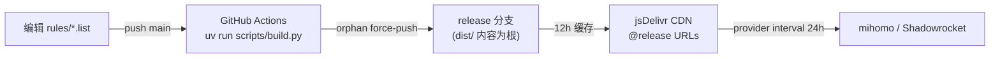

# 发布链路：从 git push 到客户端生效



## release 分支模式（Loyalsoldier 风格）

CI（[.github/workflows/build.yml](../.github/workflows/build.yml)）在每次
push `main`、以及每周一定时任务时：

1. `uv run scripts/build.py` —— 校验每一行规则，任何坏行直接 fail，
   坏内容到不了消费者。
2. 在 `dist/` 里 `git init -b release` 新建孤儿仓库、单 commit 强推到
   `origin/release`。

要点：

- **`release` 分支没有历史**，每次都是全新单 commit 强推。不要在上面手工
  提交任何东西。
- **`dist/` 的内容是 release 分支的根**——这就是消费 URL 里没有 `dist/`
  前缀的原因（`@release/clash/x.list` 而非 `@release/dist/clash/x.list`）。
- `dist/` 在 `main` 上被 gitignore，本地构建产物永远不进 main。
- 消费者钉 `@release` 而非 `@main`：`main` 上的半成品编辑永远到不了客户端，
  只有过了 CI 校验的构建才会发布。
- 每周定时重建是为了仓库长期没 commit 时 release 分支也保持"新鲜"
  （CDN/客户端侧看到的 Last-Modified 不至于太老）。

## 端到端延迟与强制刷新

各级缓存叠加（详见 [jsdelivr.md](jsdelivr.md)）：

| 环节 | 延迟 | 能否强制 |
|---|---|---|
| CI 构建+发布 | ~1 分钟 | Actions 页面手动 `workflow_dispatch` |
| jsDelivr 分支缓存 | ≤ 12 小时 | 基本不能（purge 对分支不保证） |
| 客户端 provider interval | 86400s（示例配置） | 能，见下 |

客户端侧强刷（mihomo REST API，绕过 interval 立即重新下载 provider）：

```bash
# 刷新单个 rule-provider
curl -X PUT "http://127.0.0.1:9090/providers/rules/ai" \
  -H "Authorization: Bearer $CLASH_SECRET"

# 或整体强制重载配置
curl -X PUT "http://127.0.0.1:9090/configs?force=true" \
  -H "Authorization: Bearer $CLASH_SECRET"
```

Shadowrocket：配置页下拉刷新 / 关开规则更新即可。

注意客户端强刷拿到的仍是 **CDN 当前缓存的版本**——如果 jsDelivr 还没过
12 小时窗口，刷了也还是旧的。真正零延迟验证新规则的办法是临时把 provider
URL 指向 `raw.githubusercontent.com/.../release/...`（走代理可达）或本地
文件，确认无误后再切回 CDN。

## 安全模型：规则公开、节点私有

本仓库只放通用路由规则——没有服务器地址、UUID、订阅链接，所以可以放心
走公共 CDN 明文分发。节点列表属于机密，放在别处（带 header token /
隐藏路径鉴权），见 DockerCompose-V2Ray 的
[SelfHostProviders.md](https://github.com/daviddwlee84/DockerCompose-V2Ray/blob/master/docs/clash/SelfHostProviders.md)。
两者唯一的交点是客户端 base config 同时引用它们。
